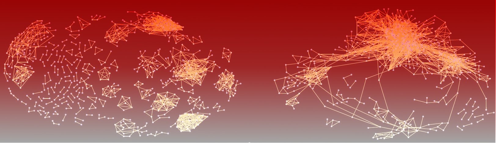

# This web page contains material presented in the manuscript

Pascual-Garcia A, Abia D, Ortiz AR, Bastolla U, 2009
**Cross-Over between Discrete and Continuous Protein Structure Space: Insights into Automatic Classification and Networks of Protein Structures**
_PLoS Comput Biol_ 5(3): e1000331. doi:10.1371/journal.pcbi.1000331

(Centro de Biologia Molecular Severo Ochoa (CSIC-UAM), Cantoblanco, Madrid, Spain).
For questions and comments, please contact "ubastolla(at)csic(dot)es" or "alberto.pascual.garcia(at)gmail(dot)com"

Summary
--------

In this work, we ask ourselves whether and up to which point it is possible to objectively and consistently classify protein domains based on a structure similarity measure. To address this question, we test whether a similarity measure is approximately transitive on the set of protein domains, such that a similar to b and b similar to c implies that a is similar to c, in such a way that we can use it to define an equivalence relationship. We find from our analysis that similarity measures are approximately transitive at high similarity, but they loose this characteristic at low similarity. We can locate a cross-over point below which clustering is not justified and significant similarity relationships should be represented as a network rather than a tree. The qualitative features of the cross-over point are very robust with respect to methodological changes.

We apply this method to a set of 2890 domains with less than 40 percent sequence indentity, decomposed in a similar way in the CATH and SCOP databases (their size differences are smaller than 10%). We use as similarity measure the contact overlap, normalized to remove the dependence on domain length for unrelated domains, and computed with respect to the structural alignment produced with the program MAMMOTH-mult. The domains are clusterd using the average linkage algorithm, and the cross-over point is determined. The classification at the cross-over point is here referred to as Automatic classification. Clusters are then joined in two networks, one expressing significant structure similarity (S>4) and another one expressing an evolutionary relationship in the form of at least two domains of the same CATH or SCOP superfamily in the linked pair.

Here is a list of the files that describe the classification and networks.

SCOP-CATH_Domain_Consens.dat
----------------------------

This file contains the list of domains used, in the following format:
* SCOP domain code, domain size, SCOP superfamily code, SCOP fold cod, SCOP family code,
* CATH domain code, domain size, CATH superfamily code, CATH fold code, CATH family code

Clusters.dat
-------------

List of clusters. For each of them, we give a summary and then the list of domains, with the format:

* Cluster code, SCOP: domain code, fold, superfamily, family, length. CATH: domain code, topology, superfamily, S35 code, length

Representants_List.dat
----------------------

For each cluster, we give a domain that represents it, chosen in the majoritary CATH and SCOP superfamily. The following information is given:

* Cluster code, SCOP domain code, CATH domain code, SCOP fold, CATH fold, SCOP superfamily, CATH superfamily, SCOP failym,CATH S35, number of elements in the cluster.

Similarity_Network.dat
----------------------

List of significant structure similarities between clusters (S>4). Format:
* Structure similarity, Cluster1 code, Cluster2 code, Database relationship (1= Same superfamily in SCOP; 2= Same superfamily in CATH; 3= Same superfamily in both; 4= Same fold in CATH or SCOP; 0= No relationship).

Evolutive_Network.dat
---------------------

List of pairs of clusters with evolutionary relationships inferred from CATH or SCOP. Same format as above.
